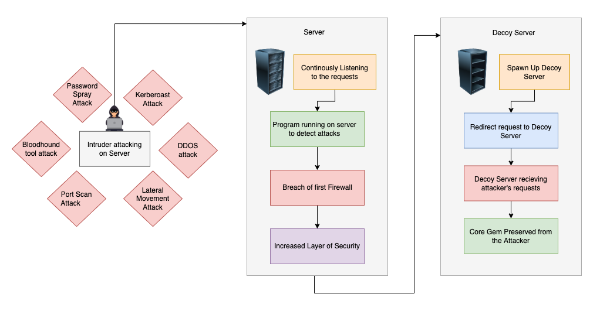
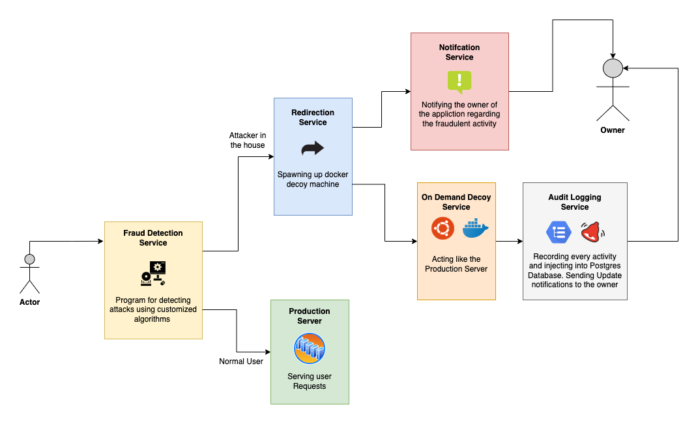
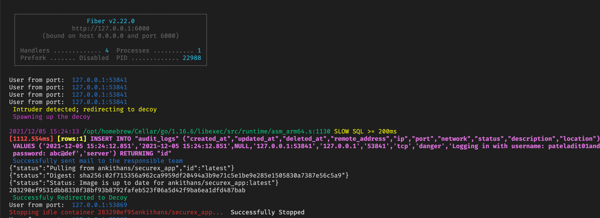
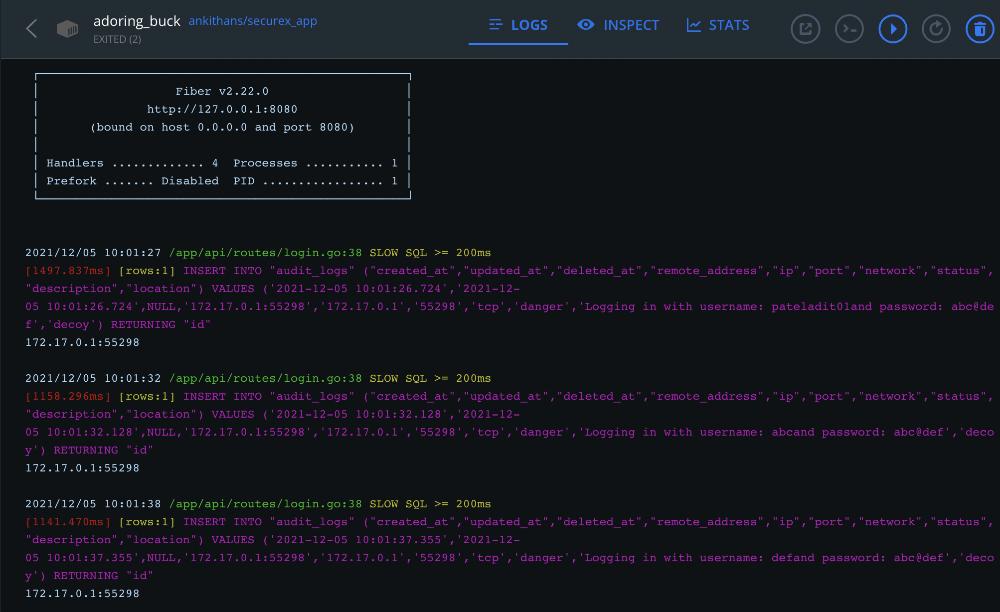
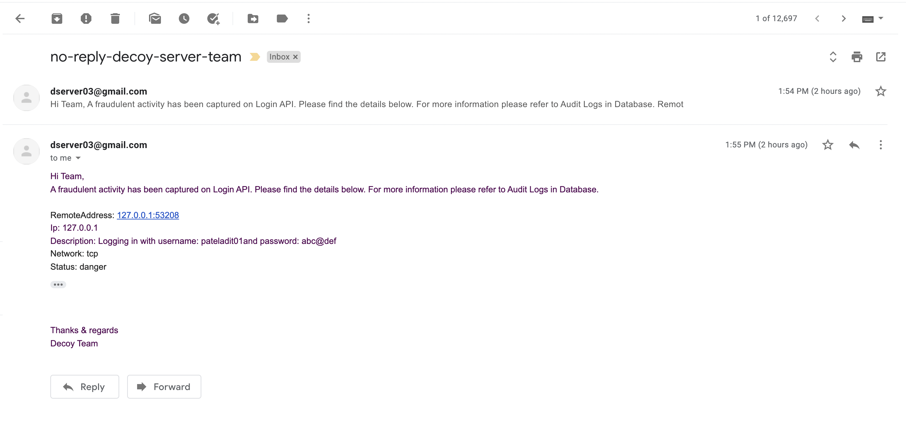
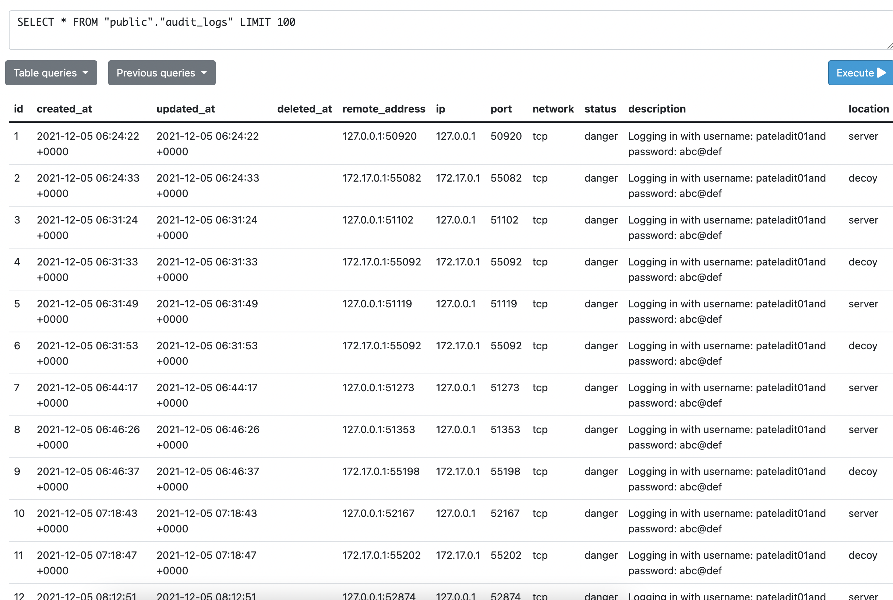

<!-- > NOTE: under contruction -->

# SecureX
Spawning up Decoy Server in case of any fraudulent activity and directing the intruder towards the decoy. Auto Killing the decoy if it is idle for too long.

> Here Decoy is Dockerised Golang API and the attack that is considered is Password Spray Attack

## Links
- Docker Hub Image - https://hub.docker.com/repository/docker/ankithans/securex_app

<!--  -->
## Process Diagram

## How to run locally
1. Set up `.env` file according to the `.env.sample` file
2. Email and Password should be a google account while turning on low secure apps
3. Enter `go run server.go` to run the golang server
4. Run `go run intruder/password_spray.go` to start password spray simulation

## Services
#### Fraud Detection Service
Currently the detection of Password Spray Attack is done using its own properties. Attackers attempt the same password on many accounts before moving on to another and repeating the process
- Counting number of logins from the same Port which are done simultaneously
- If count is greater than a threshold then declare it as a Password Spray attack

#### Redirection Service
In case of Fraud
- Spawning up of Decoy Machine
- Notifying on mailing list
- Redirecting the API call to Decoy Server

#### On Demand Decoy Service
- Docker Container as a Decoy
- Fake Data and Configuration while ensuring similar experience as original server to the Intruder
- All the Activities in Decoy are Recorded and Monitored as Audit Logs
- Auto Kill the Decoy if it is idle for more than a minute (using concurrency)

#### Notification Service
- Notifying the teams that are responsible for taking action against the fraudulent activity
- Using SMTP Email Services

#### Audit Logging Service
- Recording all interactions of Intruder with Decoy
- Storing IP, Port, Network Type, Location, Description and status of the Activity
- Useful to Recreate the whole Process if required

## Mockups

## Tech Stack
Golang, Docker, SMTP, PostgreSQL, Scripting

## Tasks
1. ~~Create a golang API for login~~
2. ~~System to detect the port scan attack or password spray attack~~
3. ~~Docker container with the same Golang API~~
4. ~~Spawn the Docker container programmatically on a specific port~~
5. ~~Redirect the intruder to server created by docker container~~
6. ~~Shut down container if it is idle~~
7. ~~Audit Logging service in the container API~~
8. ~~Notification service in the container API~~
9. ~~Improve dataset for logins~~

---
> Made with love by [Ankit Hans](https://www.github.com/ankithans)